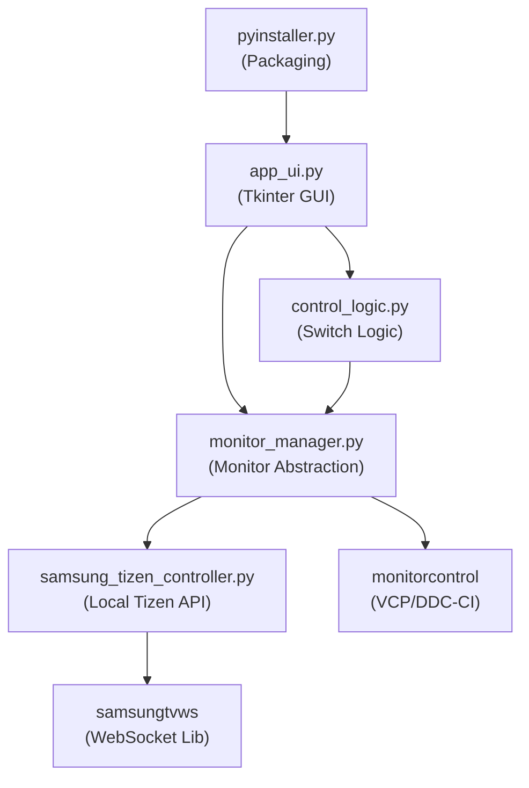

# Monitor Input Switch

A desktop application for switching monitor input sources (HDMI/DisplayPort) with a modern GUI. Built with Python, featuring hybrid control via DDC/CI (VCP) and Local Tizen API for Samsung monitors.

---

## Table of Contents
- [Project Overview](#project-overview)
- [Features](#features)
- [Architecture Diagram](#architecture-diagram)
- [Folder Structure](#folder-structure)
- [Core Components](#core-components)
  - [app_ui.py (GUI)](#app_uipy-gui)
  - [monitor_manager.py (Monitor Abstraction)](#monitor_managerpy-monitor-abstraction)
  - [control_logic.py (Input Switching Logic)](#control_logicpy-input-switching-logic)
  - [samsung_tizen_controller.py (Samsung Local API)](#samsung_tizen_controllerpy-samsung-local-api)
  - [pyinstaller.py (Packaging)](#pyinstallerpy-packaging)
- [Implementation Details](#implementation-details)
  - [Monitor Detection](#monitor-detection)
  - [Input Switching](#input-switching)
  - [Samsung Local Integration](#samsung-local-integration)
  - [GUI Layout & User Experience](#gui-layout--user-experience)
  - [Error Handling](#error-handling)
  - [Packaging with PyInstaller](#packaging-with-pyinstaller)
- [Setup](#setup)
- [Example Usage](#example-usage)
- [Troubleshooting & FAQ](#troubleshooting--faq)
- [Credits](#credits)

---

## Project Overview

Monitor Input Switch is a desktop utility that allows users to quickly switch the input source of their connected monitors (e.g., from HDMI to DisplayPort) using a graphical interface. It is especially useful for multi-monitor setups and KVM-like workflows.

**Hybrid Control Approach:**
- **VCP/DDC-CI**: Local USB control for compatible monitors (instant)
- **Samsung Tizen**: Local network control for Samsung Smart Monitors (offline, no cloud)

## Features
- Detects all connected monitors and displays their model names.
- Allows toggling input source (HDMI1/DP1) per monitor.
- **Hybrid control**: VCP for compatible monitors, Local Tizen API for Samsung displays.
- **Samsung Local Control**: Offline WebSocket control (~4-5s delay for macro execution).
- Native Windows title bar with dark mode integration.
- Windows snap support (Win+Left/Right/Up/Down arrows).
- Appears in Windows taskbar with custom dark icon.
- Fast switching with visual feedback (button color changes).
- Custom dark UI theme with background image.
- Restart and Exit controls.
- Windows support (primary platform), with potential Linux/macOS compatibility for VCP monitors.

## Architecture Diagram



## Folder Structure

```
├── app_ui.py                      # Main GUI application (custom title bar, taskbar integration)
├── monitor_manager.py             # Monitor abstraction and detection
├── control_logic.py               # Input switching logic
├── samsung_tizen_controller.py    # Local WebSocket control (offline mode)
├── local_config.json              # Local Monitor IP configuration
├── pyinstaller.py                 # Build script for packaging
├── background.jpg                 # GUI background image
├── monitor_icon.jpg               # Monitor icon for buttons
├── dark_icon.png                  # Application icon (window/taskbar)
├── requirements.txt               # Python dependencies
├── README.md                      # This file
├── dist/                          # Built executables (after packaging)
├── .venv/                         # Virtual environment
```

## Core Components

### app_ui.py (GUI)
- Implements the Tkinter-based GUI with native Windows title bar.
- Dark mode title bar using Windows DWM API (DWMWA_USE_IMMERSIVE_DARK_MODE).
- Supports Windows snap gestures (Win+Arrow keys) while maintaining fixed size.
- Draggable via background image.
- Handles layout, monitor controls, and visual feedback.
- Loads background and icons dynamically (dark_icon.png for window, monitor_icon.jpg for buttons).
- Calls monitor_manager to detect monitors and control_logic to switch inputs.

**Key snippet:**
```python
from monitor_manager import initialize_monitors
import control_logic
# ...
def create_gui():
    # ...
    show_loading_screen(root_window)
    def detect_and_finish():
        detected = initialize_monitors()
        root_window.after(0, lambda: finish_gui_setup(detected))
    threading.Thread(target=detect_and_finish, daemon=True).start()
```

### monitor_manager.py (Monitor Abstraction)
- Wraps the monitorcontrol library for VCP/DDC-CI monitors.
- Integrates samsung_tizen_controller for local WebSocket control (offline mode).
- Provides MyMonitor class with unified interface regardless of control method.
- Automatically detects and uses appropriate control method per monitor.
- Token persistence in Windows AppData for seamless local control experience.
- Handles errors and retries.

**Key snippet:**
```python
class MyMonitor:
    def set_input_source(self, desired_source_str, offline_mode=False):
        if self.is_tizen:
            # Use local WebSocket control (offline)
            return self.tizen_controller.set_input_source(desired_source_str)
        else:
            # Standard VCP control
            with self.monitor:
                self.monitor.set_input_source(desired_source_str)
```

### samsung_tizen_controller.py (Samsung Local API)
- Handles Samsung Tizen WebSocket communication (port 8002).
- Uses navigation macros (Right/Left) to switch inputs on monitors that don't support direct source keys.
- Maintains internal state tracking to know current source (HDMI/DP).
- Manages authentication tokens automatically.

**Key snippet:**
```python
class SamsungTizenController:
    def set_input_source(self, source):
        # ... macro logic ...
        self.send_key("KEY_MORE") 
        time.sleep(2.0)
        self.send_key("KEY_ENTER")
        # Navigate relative to current state
        if current == "HDMI1" and target == "DP1":
             self.send_key("KEY_RIGHT")
        self.send_key("KEY_ENTER")
```

### control_logic.py (Input Switching Logic)
- Contains logic to toggle between HDMI1 and DP1.
- Adds delay for monitor stabilization.

**Key snippet:**
```python
def toggle_monitor_input(monitor):
    current_source = monitor.get_current_source_str()
    new_source = "DP1" if current_source == "HDMI1" else "HDMI1"
    success = monitor.set_input_source(new_source)
    time.sleep(2)
    return success, new_source
```

### pyinstaller.py (Packaging)
- Automates building a standalone executable.
- Handles icon conversion (e.g., .png → .ico for Windows).
- Adds required data files (background, button icons, app icon).
- Uses dark_icon.png for executable icon.

**Key snippet:**
```python
command = [
    sys.executable, '-m', 'PyInstaller', '--onefile', '--windowed',
    '--name', 'MonitorInputSwitch',
    f'--add-data=background.jpg{data_sep}.',
    f'--add-data=monitor_icon.jpg{data_sep}.',
    f'--add-data=dark_icon.png{data_sep}.',
]
# ...icon handling...
subprocess.run(command, ...)
```

## Implementation Details

### Monitor Detection
- Uses `monitorcontrol.get_monitors()` to enumerate VCP/DDC-CI compatible displays.
- For Samsung monitors without VCP support, uses SmartThings API integration.
- Each monitor is wrapped in a `MyMonitor` object with unified interface.
- Monitor index 3 is hardcoded to use SmartThings (configurable for your setup).
- Model names and current input sources are queried and displayed in the GUI.

### Input Switching
- The GUI button for each monitor calls `toggle_monitor_input()` with optional `offline_mode` parameter.
- The function toggles between HDMI1 and DP1 (can be extended for more sources).
- **VCP monitors**: Instant local switching via USB DDC/CI protocol (works offline).
- **SmartThings monitors (cloud mode)**: Fast API calls to Samsung servers (~2s, requires internet).
- **SmartThings monitors (offline mode)**: Local WebSocket control via OSD navigation macros (~14s, works offline).
- Visual feedback is provided (button color changes on success/failure).

### SmartThings Integration
- **Purpose**: Control Samsung monitors that don't support VCP/DDC-CI.
- **Cloud Mode**: Fast switching (~2s) via SmartThings REST API.
  - Requirements: Internet connection, Samsung SmartThings account, API token.
  - Setup: See [SMARTTHINGS_SETUP.md](SMARTTHINGS_SETUP.md) for detailed instructions.
- **Offline Mode**: Local network WebSocket control (~14s) via OSD navigation.
  - Requirements: Monitor on same local network, pairing token (auto-saved in AppData).
  - How it works: Sends remote control key sequences to navigate monitor's OSD menu.
- **Configuration**: Credentials stored in `smartthings_config.json` (cloud) and `AppData/MonitorInputSwitch/samsung_g8_token.txt` (offline).
- **Token Persistence**: API tokens expire periodically - regenerate at https://account.smartthings.com/tokens when needed.
- **Compatibility**: Tested with Samsung Odyssey G8 (LS34DG850SUXDU).

### GUI Layout & User Experience
- Custom dark title bar (#1a1a1a) blends with app theme - no white Windows title bar.
- Appears in Windows taskbar despite borderless design (Win32 API integration).
- Draggable via custom title bar or background image (with proper offset calculation).
- Monitors are arranged in a 2x2 grid (top/bottom left/right), with swap functionality for left monitors.
- Custom background and icons for a modern look.
- Exit and Restart buttons at the bottom.

**GUI Layout Example:**


### Error Handling
- All monitor operations are wrapped in try/except blocks.
- Errors are printed to the console and reflected in the GUI (e.g., button turns red).
- Initialization errors are shown as "Error" in the monitor status.

### Packaging with PyInstaller
- `pyinstaller.py` script automates building the app for distribution.
- Handles icon conversion and data file inclusion.
- Produces a single-file executable for easy deployment.

## Setup

1. **Install Python 3.8+** (tested with Python 3.13.1)

2. **Clone the repository:**
   ```sh
   git clone <repository-url>
   cd MonitorInputSwitch
   ```

3. **Create virtual environment:**
   ```sh
   python -m venv .venv
   .venv\Scripts\activate  # Windows
   source .venv/bin/activate  # Linux/macOS
   ```

4. **Install dependencies:**
   ```sh
   pip install -r requirements.txt
   ```

5. **Setup Samsung Monitor (Optional):**
   - Run the local auth setup wizard:
     ```sh
     python setup_local_auth.py
     ```
   - Enter your monitor's IP address.
   - Click "Allow" on the monitor popup.
   - This creates `local_config.json` and saves the auth token.

## Example Usage

1. **Run the app:**
   ```sh
   python app_ui.py
   ```

2. **Build an executable:**
   ```sh
   python pyinstaller.py
   # Output will be in the 'dist' folder
   ```

3. **Switch monitor input:**
   - Click the "Switch Input" button for any monitor in the GUI.
   - Button turns green on success, orange/red on error.
   - VCP monitors: Instant switching
   - Samsung monitors: ~4-5 second delay (OSD macro)

## Troubleshooting & FAQ

- **Q: No monitors detected?**
  - **VCP monitors**: Ensure DDC/CI is enabled in monitor OSD settings.
  - Try running as administrator (Windows).
  - Check that the `monitorcontrol` library supports your hardware.
  - **Samsung monitors**: Ensure `local_config.json` is configured correctly.

- **Q: Input not switching?**
  - **VCP monitors**: Not all monitors support input switching via DDC/CI.
  - **Samsung monitors**: Check local network connection.
    - Run `python setup_local_auth.py` to re-pair if needed.
    - Ensure monitor is ON and connected to the same network.
  - Check the console/terminal for error messages.
  - Verify monitor supports the target input source.

- **Q: Samsung monitor not working?**
  - Verify `local_config.json` exists with valid IP.
  - Run `python setup_local_auth.py` to refresh the token.
  - Check that monitor is connected to network.

- **Q: App window not draggable?**
  - Drag the background image area, not the controls.

- **Q: Packaging fails?**
  - Ensure all dependencies are installed (`pip install -r requirements.txt`).
  - For icon conversion, Pillow is required.

## Credits
- Developed by MCDIX incorporated
- **VCP Control**: [monitorcontrol](https://github.com/newAM/monitorcontrol)
- **Samsung Local Control**: [samsungtvws](https://github.com/xchwarze/samsung-tv-ws-api)
- **GUI**: Tkinter, Pillow
- **Packaging**: PyInstaller

---

*For questions or contributions, open an issue or pull request on GitHub.*
